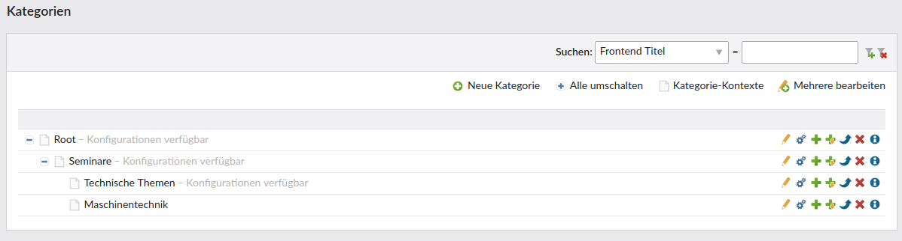
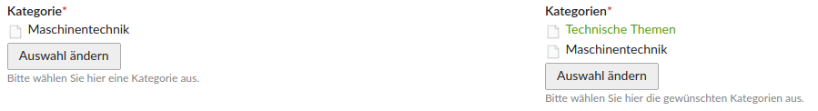
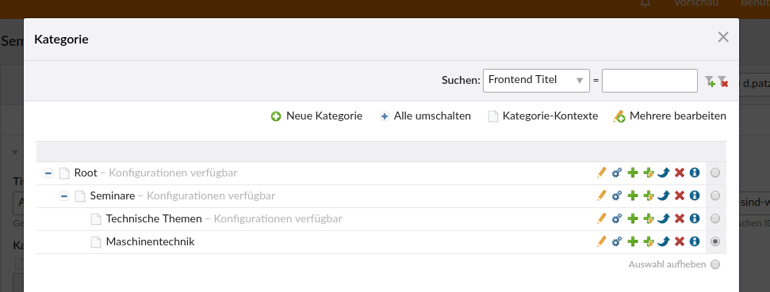
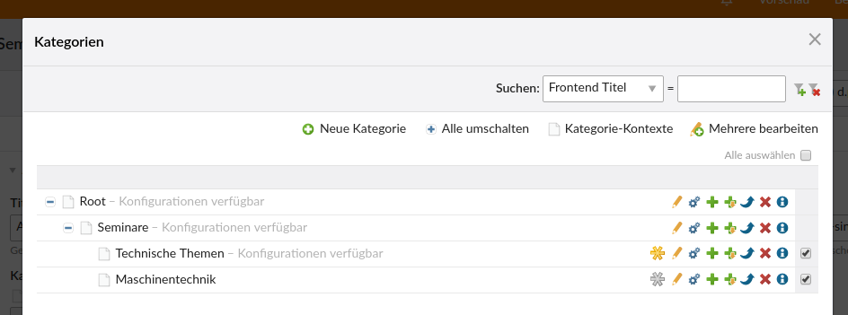
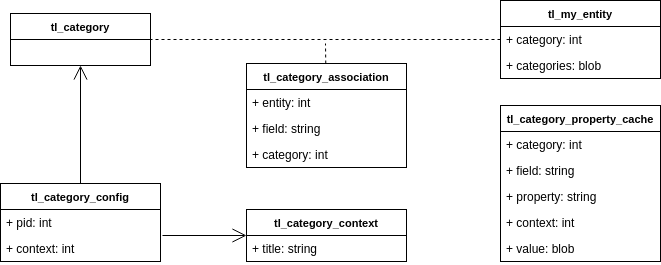
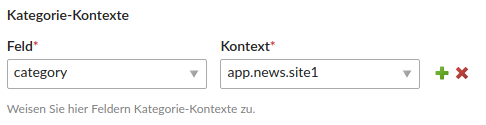
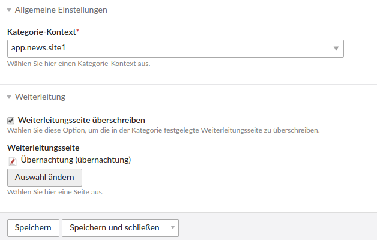

# Contao Categories Bundle

This bundle allows to assign nestable categories to arbitrary entities in Contao-driven systems.

## Features

- the module is done in a generic way, i.e. you can assign category/categories field(s) to arbitrary DCAs
- conveniently add single category fields (radio button) or multiple categories fields (checkbox) via a simple function call
- specify overridable properties in categories and compute the correct result depending on the given context easily

## Impressions

### Category management



Main category management view. By clicking the cog icon you can navigate to the *category configs*.

### Widget integration in your DCA



Add category fields to your DCA easily. The category marked as *primary category* is colored in green.

### Picker widgets



Single category picker with radio buttons (selecting parent categories is allowed -> can be disallowed if necessary; no primary category marker necessary)



Single category picker with checkboxes (selecting parent categories is disallowed; the yellow asterisk marks the primary category -> this attribute is stored to an automatically created field named `<categoriesFieldname>_primary`)

## Entity structure



Table | Description
----- | -----------
tl_category | Contains the *category* instances
tl_category_association | Association table between tl_category and your DCA's table
tl_category_context | Defines context keys (simple strings) usable in *category configs*
tl_category_config | Contains *category configs*. Here you can override properties defined per default in a category linked with a certain *category context*
tl_category_property_cache | Contains the resolved overridable property values

## Concepts

### Primary category

When assigning a multiple category (checkbox) field to your DCA, you might want the editor to specify to mark some of the categories as the *primary* one.
This is e.g. necessary if some field (e.g. jumpTo) can be overridden by a concrete category.

### Overridable properties

You can specify special *overridable properties* in one of the following objects (highest number is highest priority):

1. a *category*
2. a *category config* assigned to the *category* in 1.
3. a *sub category* of the *category* in 1.
4. a *category config* assigned to the *category* in 3.

*HINT 1: The steps might be happening recursively if you have more than 1 hierarchy levels.*

*HINT 2: Using category configs is not mandatory. Simple overriding in sub categories works anyway.*

For simple illustration, consider the following:

Category A is the root category and has a child category B. Category B has again the child category C. Then the priority would be as follows:

*(Given that the context triggers the category configs)*

`category config of C > category C > category config of B > category B > category config of A > category A`

Of if you don't want to use category configs, it's

`category C > category B > category A`

#### Retrieving the context sensitive property value

After defining this hierarchy, you can easily retrieve the context sensitive property value by calling

```
$value = \System::getContainer()->get('huh.categories.manager')->getOverridableProperty(
    <propertyName>, <some context object containing a field-to-context-mapping>, <category/categories field name>, <primary category id>
);
```

*HINT: Of course, you don't have to use `getOverridableProperty()`. You can also specify your own inheritance logic.*

You now might ask, how it is decided which of the category configs is used and what the purpose of the *context object* is. See the example below:

#### Example

Consider the following requirements:

1. You want to implement two news lists on 2 different pages.
2. The news on page 1 are in news archive 1 and the news on page 2 are in news archive 2.
3. But: All news share the same categories.
4. Now you want to have different jumpTo urls based on:
     1. the concrete category assigned to the news, i.e. the jumpTo is defined in the category
     2. the jumpTo differs with the news archive *in combination with the category*, i.e. if a news has some category *and is in news archive 1*, it should have a different jumpTo than if it had the same category and was in news archive 2

This is not possible using the classic assignment of jumpTo's to the news archives. In fact you would end up with duplicate content management (evil!).

Now how do you implement that? -> see the next chapter "Technical instructions"

## Technical instructions

The instructions here illustrate the example described in the example above.

### Add a category/categories field to your DCA

Do this using one of the following calls:

```
$GLOBALS['TL_DCA']['tl_my_dca']['fields']['category'] = \HeimrichHannot\CategoriesBundle\Backend\Category::getCategoryFieldDca(
    [
        'addPrimaryCategory'   => false, // default false for single category widgets
        'forcePrimaryCategory' => false, // default false for single category widgets
        'parentsUnselectable'  => true, // default false; you can alternatively set "selectable" via Contao backend for single parent categories
        // you can also set optional Contao DCA picker options here:
        'rootNodes'            => [77] // if set, the available categories are limited to the children categories of the category defined here
    ]
);

// this call automatically adds the field "<categoriesFieldname>_primary" which is a simple integer field that contains the reference to the category marked as primary
\HeimrichHannot\CategoriesBundle\Backend\Category::addMultipleCategoriesFieldToDca('tl_seminar', 'categories',
    [
        'addPrimaryCategory'   => true, // default true for multiple category widgets
        'forcePrimaryCategory' => true, // default true for multiple category widgets
        'parentsUnselectable'  => true, // default false; you can alternatively set "selectable" via Contao backend for single parent categories
        // you can also set optional Contao DCA picker options here:
        'rootNodes'            => [77] // if set, the available categories are limited to the children categories of the category defined here
    ]
);
```

### Use category configs

1\. Add context keys:


2\. Add the field-to-context mapping widget to the object acting as *context object*.

HINT: The *context object* could be _any_ object you want.

```
\HeimrichHannot\CategoriesBundle\Backend\CategoryContext::addFieldContextMappingFieldToDca('tl_my_dca_archive', 'tl_my_dca');
```

Add the field `categoryFieldContextMapping` to your palette:

```
$GLOBALS['TL_DCA']['tl_my_dca_archive']['palettes']['default'] = str_replace('someField', 'someField,categoryFieldContextMapping', $GLOBALS['TL_DCA']['tl_my_dca_archive']['palettes']['default']);
```

This results in the following widget added to your archive:



*HINT: Typically you'll want to have only one row *per field* in this multi column widget.*

3\. Add category configs by clicking the corresponding cog icon in the category list view according to your needs:



4\. In your list module, retrieve the context sensitive overridable property "jumpTo" by calling:

```
$value = \System::getContainer()->get('huh.categories.manager')->getOverridableProperty(
    'jumpTo', $archiveObject, 'categories', $item->categories_primary
);
```

### Add new overridable properties

1\. Just like the field `jumpTo` in `tl_category` you can of course add more overridable properties in an easy way. Simply add your field and ensure that the eval key `overridable` is set to `true` in *your* `tl_category` and the save_callback for clearing the relevant cache data is in place.

```
$GLOBALS['TL_DCA']['tl_category']['myOverridableTextField'] = [
    'label'         => &$GLOBALS['TL_LANG']['tl_category']['myOverridableTextField'],
    'exclude'       => true,
    'inputType'     => 'text',
    'save_callback' => [['HeimrichHannot\CategoriesBundle\Backend\Category', 'deleteCachedPropertyValuesByCategoryAndProperty']],
    'eval'          => ['overridable' => true],
    'sql'           => "varchar(255) NOT NULL default ''"
];
```

This automatically adds a boolean field for overriding the field in sub categories. You might want to add a localization label for the field called `overrideMyOverridableTextField`.

2\. If you also want the field to be overridable in category configs (which is not mandatory, but can be helpful!), simply call the following command in *your* `tl_category_config`:

```
\HeimrichHannot\Haste\Dca\General::addOverridableFields(['myOverridableTextField'], 'tl_category', 'tl_category_config');
```

## Caching

The bundle comes with integrated caching for overridable properties. It's a simple database cache (see `tl_category_property_cache`) getting in place when calling `\System::getContainer()->get('huh.categories.manager')->getOverridableProperty()`.

## Module

Name | Description
----- | -----------
categoriesMenu | Creates a Menu from categories

### Filter a list by categories

Add the categories filter field to you dca:

```
$GLOBALS['TL_DCA']['tl_my_dca']['fields']['my_field'] = \HeimrichHannot\CategoriesBundle\Backend\Category::getCategoryFieldDca($eval, $label);
```

Add this code to your List to get the category and find all entities with the given category and table

```
$strParam = Category::getUrlParameterName();

// Try to find by category
if ($this->module->news_filterCategories && Request::getGet($strParam)) {
	$arrEntityIds = \System::getContainer()->get('huh.categories.manager')->getEntityIdsByCategoryAndParentTable(Request::getGet($strParam), $your_table);
	// do something e.g. NewsModel::findByMultipleIds($arrEntityIds)
}
```

## Twig filters

For usage inside a twig template we provide filters that will return the category/categories itself by given ids:

### single category filter

```

    
    <span class="{{ category.alias }}">
        {{ category.title }}
    </span>

```

```

    
    <span class="{{ category.alias }}">
        {{ category.title }}
    </span>

```

### multiple categories filter

```

    <div class="category {{ raw.type|default('') }}">
        
            <span class="{{ category.alias }}">
                {{ category.title }}
            </span>
        
    </div>

```