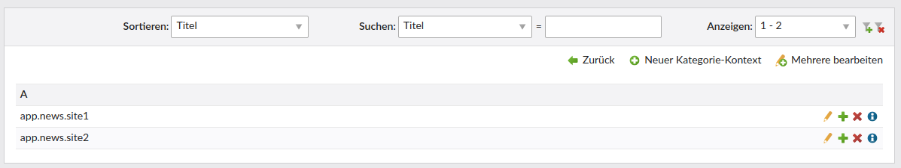

# Technical instructions

The instructions here illustrate the example described in the example above.

## Add a category/categories field to your DCA

Do this using one of the following calls:

```php
use HeimrichHannot\CategoriesBundle\Backend\Category;

// Single category widget
// Usage 
Category::addSingleCategoryFieldToDca(string $table, string $fieldName, array $evalOverride => null, array $label = null);
// Example
Category::addSingleCategoryFieldToDca('tl_calendar_events', 'category', [
    'addPrimaryCategory'   => false,
    'rootNodes'            => [77]
]);

// Multiple category widget
// this call automatically adds the field "<categoriesFieldname>_primary" which is a simple integer field that contains the reference to the category marked as primary
// Usage:
Category::addMultipleCategoriesFieldToDca(string $table, string $name, array $evalOverride = null, array $label = null);
Category::addMultipleCategoriesFieldToDca('tl_seminar', 'categories', [
    'addPrimaryCategory'   => true,
    'forcePrimaryCategory' => true,
    'parentsUnselectable'  => true,
    'rootNodes'            => [77],
]);
```

### Eval options

| Options               | Type  | Description                                                                                                  |
|-----------------------|-------|--------------------------------------------------------------------------------------------------------------|
| addPrimaryCategory    | bool  | Default false for single category widgets, default true for multiple category widgets.                       |
| forcePrimaryCategory  | bool  | Default false for single category widgets, default true for multiple category widgets.                       |
| parentsUnselectable   | bool  | You can alternatively set "selectable" via Contao backend for single parent categories. Default true.        |
| rootNodes             | array | Available categories are limited to the children categories of the category defined here                     |
| rootNodesUnselectable | bool  | Root nodes set in rootNodes option are not selectable. This currently only works in single category widgets. |


## Use category configs

1. Add context keys:

    

1. Add the field-to-context mapping widget to the object acting as *context object*.

    HINT: The *context object* could be _any_ object you want.
    
    ```
    \HeimrichHannot\CategoriesBundle\Backend\CategoryContext::addFieldContextMappingFieldToDca('tl_my_dca_archive', 'tl_my_dca');
    ```
    
    Add the field `categoryFieldContextMapping` to your palette:
    
    ```
    $GLOBALS['TL_DCA']['tl_my_dca_archive']['palettes']['default'] = str_replace('someField', 'someField,categoryFieldContextMapping', $GLOBALS['TL_DCA']['tl_my_dca_archive']['palettes']['default']);
    ```
    
    This results in the following widget added to your archive:
    
    
    
    *HINT: Typically you'll want to have only one row *per field* in this multi column widget.*

1. Add category configs by clicking the corresponding cog icon in the category list view according to your needs:

    

1. In your list module, retrieve the context sensitive overridable property "jumpTo" by calling:
    
    ```
    $value = \System::getContainer()->get('huh.categories.manager')->getOverridableProperty(
        'jumpTo', $archiveObject, 'categories', $item->categories_primary
    );
    ```

## Add new overridable properties

1\. Just like the field `jumpTo` in `tl_category` you can of course add more overridable properties in an easy way. Simply add your field and ensure that the eval key `overridable` is set to `true` in *your* `tl_category` and the save_callback for clearing the relevant cache data is in place.

```
$GLOBALS['TL_DCA']['tl_category']['myOverridableTextField'] = [
    'label'         => &$GLOBALS['TL_LANG']['tl_category']['myOverridableTextField'],
    'exclude'       => true,
    'inputType'     => 'text',
    'save_callback' => [['HeimrichHannot\CategoriesBundle\Backend\Category', 'deleteCachedPropertyValuesByCategoryAndProperty']],
    'eval'          => ['overridable' => true],
    'sql'           => "varchar(255) NOT NULL default ''"
];
```

This automatically adds a boolean field for overriding the field in sub categories. You might want to add a localization label for the field called `overrideMyOverridableTextField`.

2\. If you also want the field to be overridable in category configs (which is not mandatory, but can be helpful!), simply call the following command in *your* `tl_category_config`:

```
\HeimrichHannot\Haste\Dca\General::addOverridableFields(['myOverridableTextField'], 'tl_category', 'tl_category_config');
```

## Caching

The bundle comes with integrated caching for overridable properties. It's a simple database cache (see `tl_category_property_cache`) getting in place when calling `\System::getContainer()->get('huh.categories.manager')->getOverridableProperty()`.

## Module

Name | Description
----- | -----------
categoriesMenu | Creates a Menu from categories

### Filter a list by categories

Add the categories filter field to you dca:

```
$GLOBALS['TL_DCA']['tl_my_dca']['fields']['my_field'] = \HeimrichHannot\CategoriesBundle\Backend\Category::getCategoryFieldDca($eval, $label);
```

Add this code to your List to get the category and find all entities with the given category and table

```
$strParam = Category::getUrlParameterName();

// Try to find by category
if ($this->module->news_filterCategories && \Contao\System::getContainer()->get('huh.request')->getGet($strParam)) {
	$arrEntityIds = \System::getContainer()->get('huh.categories.manager')->getEntityIdsByCategoryAndParentTable(\Contao\System::getContainer()->get('huh.request')->getGet($strParam), $your_table);
	// do something e.g. NewsModel::findByMultipleIds($arrEntityIds)
}
```

## Twig filters

For usage inside a twig template we provide filters that will return the category/categories itself by given ids:

### single category filter

```

    
    <span class="{{ category.alias }}">
        {{ category.title }}
    </span>

```

```

    
    <span class="{{ category.alias }}">
        {{ category.title }}
    </span>

```

### multiple categories filter

```

    <div class="category {{ raw.type|default('') }}">
        
            <span class="{{ category.alias }}">
                {{ category.title }}
            </span>
        
    </div>

```


## Commands

Migrate from contao-news_categories to contao-categories-bundle.

`huh:categories:migrate-news-categories [<field>]`

Option | Description
------ | -----------
-i, --legacy-categories[=CATEGORY] | Only import categories with this id and their children. (multiple values allowed)
-x, --exclude-legacy-categories[=CATEGORY] | Skip these categories and their children. (multiple values allowed)
--dry-run | Performs a run without writing to datebase and copy templates.

Example: `huh:categories:migrate-news-categories custom_categories_field -i 20 -i 56 -x 57` (will import all categories and their association with id 20, 56 and their childs, but not 57 and its childs.)